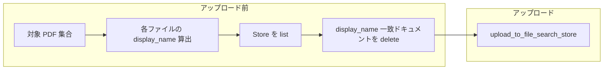

# File Search 差し替えアップロード — 設計メモ

## データフロー

## display_name の算出（本リポジトリ）

| 条件 | 値 |
|------|-----|
| 相対パスが ASCII のみ | `past/foo.pdf` のような `data/pdfs` からの POSIX 相対パス |
| パスに非 ASCII | `nonascii_{sha256(rel)[:16]}.pdf` |

採点時の答案はステージング済みファイル名に対して `file_search_display_name` を適用（セッションごとに異なる名前が付く想定）。

## CLI フラグ

| スクリプト | 既定 | `--no-replace` |
|------------|------|----------------|
| `upload_to_file_search.py` | 削除してからアップロード | 削除しない |
| `sync_store.py` | 同上 | 同上 |
| `sync_store_service_account.py` | 同上 | 同上 |

## Drive 差分同期との関係

- **新規 file ID**: 従来どおりダウンロード→（削除）→アップロード。
- **同一 file ID・内容のみ更新**: 現状の `synced_files` キーは ID のみのため **自動では再処理されない**。手動でログからキーを消すか、今後 `modifiedTime` を保持して比較する拡張が必要。

## API 依存

- `google.genai` の `Client.file_search_stores.documents.list` / `delete`。
- ページングは SDK の Pager に任せる。
